# raytrace-ruby

Ruby raytracer

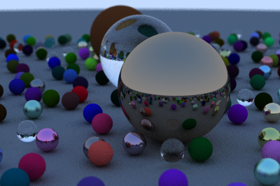

Written in Ruby 2.6 thanks largely to the book [Ray Tracing in One Weekend](https://raytracing.github.io/books/RayTracingInOneWeekend.html) by Peter Shirley.

Outputs to .ppm format (you'll need something like [GIMP](https://www.gimp.org/) to view the files). Default render size is 400px x 266px. Larger is possible, but it'll take a *looooooong* time. The above image took about 6 hours to render. For those keeping track at home, that's a very respectable 55 frames per ~~second~~ fortnight!

```
1 frame   24 hours     14 days 
------- x -------- x ----------- = 55.99 frames / fortnight
6 hours    1  day    1 fortnight
```

For each pixel, 100 light rays are fired from the source and can bounce off of an object a maximum of 50 times. For this render (400px x 266px) this means there's a theoretical maximum **532,000,000** ray bounces calculated.

## Screenshots

### Development, In Screenshots

If you want to follow along with trial-and-error for this project, screenshots in the `assets` directory are prefixed with `a` and `b`. 

* `a` screenshots represent development milestones (i.e. I rendered my first circle, I added antialiasing, etc.). 

* `b` screenshots represent setbacks or funny things I ran across while working (i.e. I tweaked a setting and now it's all broken!).

Each screenshot has a number representing a milestone. For instance, for my first render, screenshot `a01` is the development milestone and `b01` was the worst setback I encountered in the session.

The Good | The Bad
:-------:|:------:
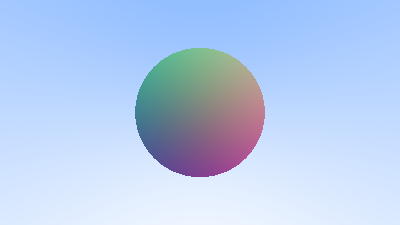 | 
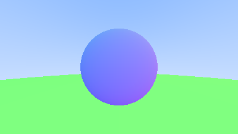 | 
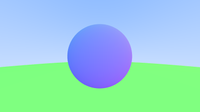 | 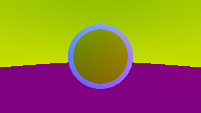
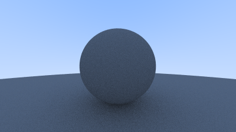 | 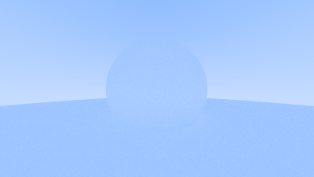
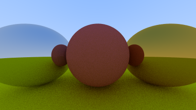 | 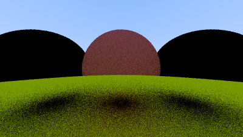
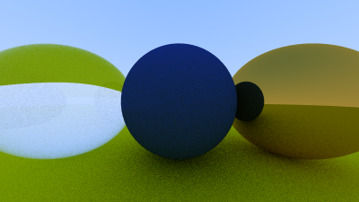 | 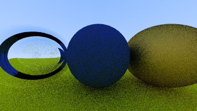
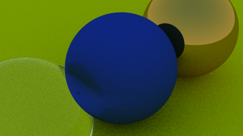 | Nothing really went wrong this time :(
 | 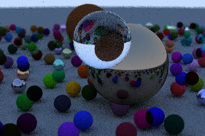

## Generate Your Own:

Clone this repository, then:

```shell
ruby main.py
```

Next, you'll probably want to grab a coffee (or six) and reflect on [this meme](https://i.redd.it/9tu18n684z331.jpg) while you wait.

When you're done, it'll have generated a new timestamped render in the `images` directory.

## Known Issues:

- If you're following along with the tutorial from the book, the trick to use a negative radius make a hollow dielectric sphere *may* not work.
  - See [this image](assets/b06_black_hole.png) for an example of what my render looked like.
  - Everything else about dielectrics seems like it works fine?

## Contact

Tyler Porter

tyler.b.porter@gmail.com